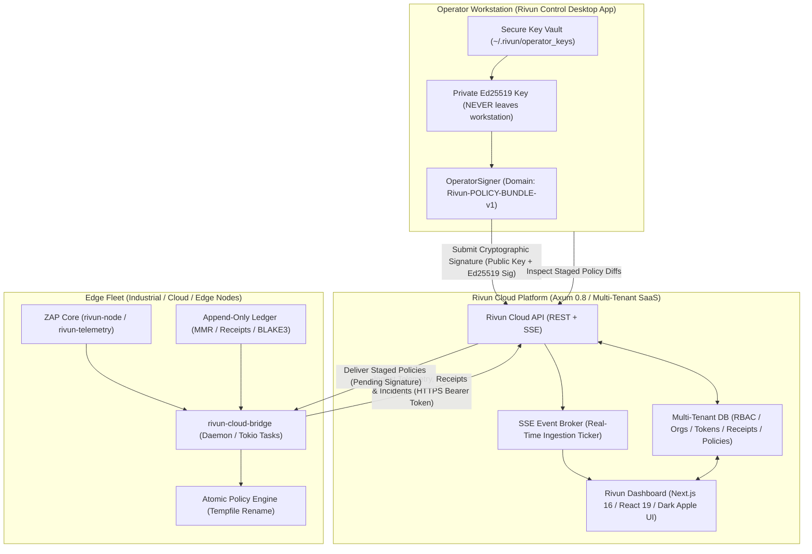

# Rivun Cloud & Operator Station — Architectural Specification & Operations Guide

**Rivun Cloud** transforms the open-source ZAP protocol from a node-by-node command-line runtime into an **enterprise multi-tenant SaaS control plane** with a dedicated local operator workstation (**Rivun Control**) and an Apple-grade dark visual dashboard (**Rivun Dashboard**).

---

## 1. Executive Architecture



---

## 2. Zero-Trust Security Invariant

The core security principle of Rivun Cloud is **Zero-Trust Sovereign Identity**:

> [!IMPORTANT]
> **Private Key Isolation Invariant**: The SaaS Cloud API and Web Dashboard **never** receive, store, or process private Ed25519 signing keys. Private keys remain exclusively inside the operator's local workstation vault (`Rivun Control`) or inside edge nodes.

### Cryptographic Lifecycle:
1. **Policy Authoring**: Operators or team members draft policies visually in `Rivun Dashboard` or write TOML.
2. **Staging**: Policy is marked `staged` in Rivun Cloud API. The cloud **cannot** push unverified policies to the edge.
3. **Local Inspection & Signing**: The operator opens `Rivun Control`, fetches the staged policy diff, inspects the rule changes, and cryptographically signs it with their local private key under the domain:
   $$\text{Domain} = \text{"Rivun-POLICY-BUNDLE-v1"}$$
   $$\text{Message} = \text{org\_id} \parallel \text{":"} \parallel \text{name} \parallel \text{":"} \parallel \text{version}_{\text{be\_bytes}} \parallel \text{":"} \parallel \text{body\_toml}$$
4. **Cloud Verification & Broadcast**: Rivun Cloud API receives `(public_key, signature)` and marks the policy `active`.
5. **Edge Verification & Atomic Apply**: `rivun-cloud-bridge` on each edge node pulls the active policy bundle, verifies the Ed25519 signature against its local operator whitelist, parses the TOML, writes to a temporary file, and performs an **atomic filesystem swap** (`tempfile::persist`). If verification fails, the node fails closed and preserves the prior policy.

---

## 3. Monorepo Components

### A. Edge Daemon: `crates/rivun-cloud-bridge`
An edge sidecar process that connects any ZAP node to Rivun Cloud.

- **Heartbeat & Telemetry**: Periodically runs 7-point `FleetDoctor` diagnostics and streams CPU, memory, peer connections, and PoA attestation rates.
- **Receipt Ingestion**: Batches append-only ledger receipts and Merkle Mountain Range (MMR) root hashes.
- **Incident Capturing**: When errors or clock skews occur, captures incident state with `SecretRedactor` client-side data scrubbing.
- **Policy Auto-Sync**: Polls Rivun Cloud for new active signed bundles and applies them atomically.

### B. SaaS Backend API: `crates/rivun-cloud-api`
High-performance Axum 0.8 multi-tenant REST and Server-Sent Events (SSE) server.

- **Multi-Tenant Isolation**: Organizations, workspaces, team RBAC (Owner, Admin, Operator, Auditor), and scoped API tokens (`ingest:write`, `policies:read`).
- **REST Endpoints**:
  - `POST /v1/ingest/telemetry` — Ingest edge node health telemetry.
  - `POST /v1/ingest/receipts` — Ingest signed receipts with causal provenance chains.
  - `POST /v1/ingest/incidents` — Ingest sanitized forensic incident bundles.
  - `GET /v1/orgs/{org}/nodes` — List edge nodes with 7-point health status.
  - `GET /v1/orgs/{org}/receipts` — Query immutable receipt records and provenance chains.
  - `POST /v1/orgs/{org}/policies` — Create draft policy.
  - `POST /v1/orgs/{org}/policies/{id}/stage` — Stage policy for operator review.
  - `POST /v1/orgs/{org}/policies/{id}/sign` — Submit operator Ed25519 signature.
  - `GET /v1/orgs/{org}/validators` — View BFT validator set and quorum threshold.
  - `GET /v1/packs` & `POST /v1/packs/publish` — Domain pack marketplace registry.
  - `GET /v1/events` — Real-time Server-Sent Events stream.

### C. Operator Station: `apps/rivun-control`
Standalone desktop application and CLI for local operators.

- **Key Vault**: Generates and stores Ed25519 identity keypairs in encrypted local files (`~/.rivun/operator_keys/`).
- **Offline Signing**: Signs policy bundles and validator set rotations without exposing keys.
- **CLI Reference**:
  ```bash
  # Generate a new local operator keypair
  rivun-control keygen --label primary-operator

  # List keys in the secure local vault
  rivun-control list-keys

  # Inspect staged policies awaiting signature on Rivun Cloud
  rivun-control staged --cloud-url https://api.rivun.cloud --org acme --token <TOKEN>

  # Cryptographically sign a staged policy bundle
  rivun-control sign --cloud-url https://api.rivun.cloud --org acme --token <TOKEN> \
    --policy-id <UUID> --key-node <OPERATOR_NODE_UUID>
  ```

### D. Web Workstation: `apps/rivun-dashboard`
Next.js 16 / React 19 / Tailwind CSS dark-mode dashboard built to Apple design standards.

- **Overview (`/`)**: Executive dashboard with live SSE streaming ticker, global Doctor health indicator, sparklines, and pending signature alerts.
- **Fleet Management (`/fleet`)**: Real-time node inventory with 7-point Doctor diagnostic badges, slide-over telemetry inspector, and P2P gossip mesh topology.
- **Receipts & Provenance Ledger (`/ledger`)**: Searchable append-only ledger with interactive 7-stage causal provenance graph ($H_{\text{intent}} \to \dots \to H_{\text{root}}$) and offline verifier modal.
- **Policy Studio (`/policies`)**: Visual conditional rule builder (Allow / Deny / Require PoA / Require Grant), 3-way side-by-side diff viewer, and staging workflow.
- **Validators & Consensus (`/validators`)**: Proof-of-Action quorum threshold ($T \le N$) visualizer and validator rotation proposals.
- **Domain Pack Marketplace (`/marketplace`)**: 7 verified Foundation packs with cryptographic manifest badges and fleet deployer.
- **Incidents & Forensics (`/incidents`)**: Scrubbed forensic evidence timeline with sanitized diagnostic payload inspector.
- **Organization & Security (`/settings`)**: Team RBAC member manager, Bridge API token generator, and immutable SaaS Meta-Audit trail.

---

## 4. Offline Verification & Trust Guarantee

Every receipt in Rivun Cloud can be independently verified on an air-gapped machine without trusting the SaaS database:

```bash
# Verify receipt integrity directly with the open-source CLI
rivun receipts verify --hash <RECEIPT_HASH> --offline
```

Mathematical proof reconstruction:
$$H_{\text{intent}} \to H_{\text{negotiation}} \to H_{\text{policy}} \to H_{\text{consensus}} \to H_{\text{driver}} \to H_{\text{poa}} \to H_{\text{receipt}} \to H_{\text{root}}$$
